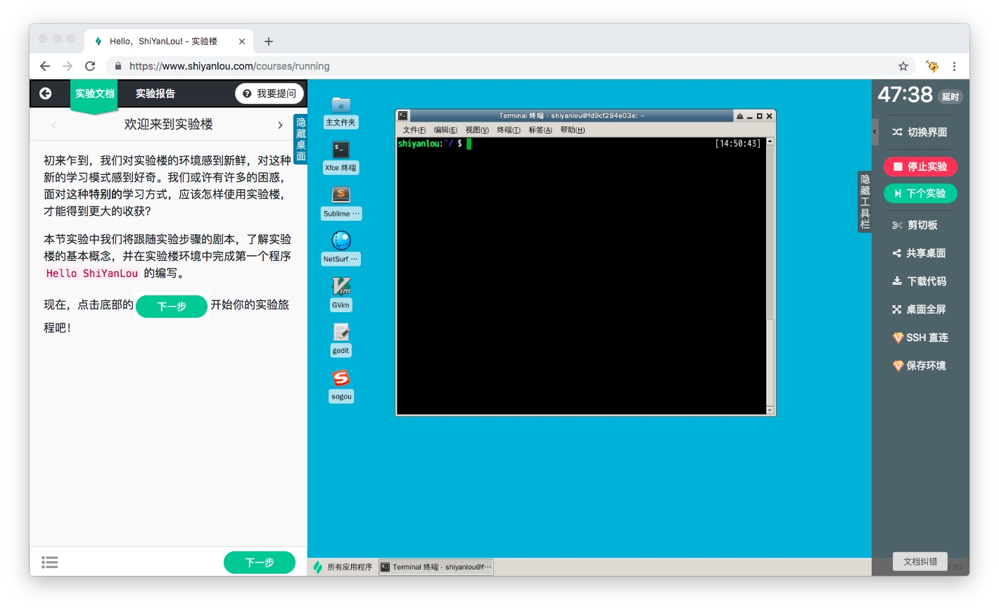
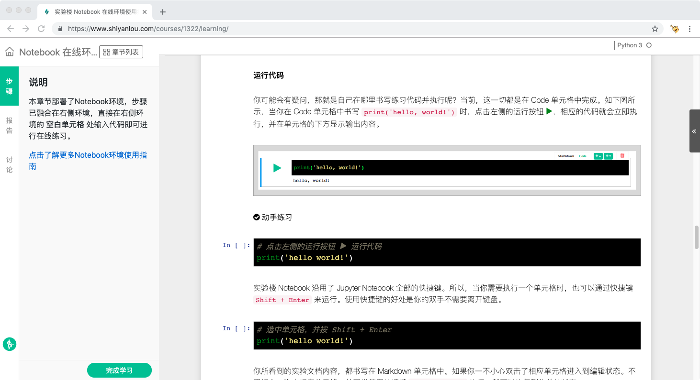

# 实验楼使用指南

本教程详细介绍实验楼的使用方法，快速上手实验楼中的各种学习工具。

## 实验楼是什么

[实验楼 shiyanlou.com](https://www.shiyanlou.com) 是一个通过在线动手实验的方式学习 IT 技术的在线教育网站。

IT 技术是实践的科学，动手实践是最高效的学习方法。实验楼设计理念也是如此：从实践切入，依靠交互性、操作性更强的课程，理论学习+动手实践激发创造力。

实验楼提供 Linux 运维、DevOps、后端开发、云计算与大数据、数据库、信息安全、Web 前端等多个领域的 3000 多个在线实验，只需要按照实验步骤在线完成实验任务，就可以收获 IT 技术。

## 主要内容

教程包括三部分内容：

1. [快速上手](quickstart/README.md)：介绍如何开始和停止实验，如何在实验中提问。
2. [功能介绍](feature/README.md)：通过细致的截图介绍实验过程中用到的各种功能。
3. [常见问题](FAQ.md)：介绍使用实验楼的时候可能遇到的问题以及解决方案。

为了让实验过程获得最优体验，实验楼为不同的课程提供了四种界面，这些界面构成了实验楼的核心，在功能介绍部分，会进行详细介绍：

* [图形界面](feature/desktop.md)
* [字符界面](feature/terminal.md)
* [Jupyter Notebook](feature/notebook.md)
* [Web IDE](feature/webide.md)

四种界面的功能支持：

|功能|图形界面|字符界面|Jupyter Notebook|Web IDE|
|---|---|---|---|---|
|实验步骤|支持|支持|注1|支持|
|实验报告|支持|支持||支持|
|切换界面|支持|支持|||
|倒计时与延时|支持|支持|支持|支持|
|有效学习时间|支持|支持|支持|支持|
|剪切板|支持|支持|注2|注2|
|共享桌面|支持||||
|下载代码|支持|支持|支持|支持|
|SSH直连（会员）|支持|支持||注3|
|保存环境（会员）|支持|支持||注3|

* 注1：Jupyter Notebook 的实验步骤已经混合到实验环境中的 Notebook 文档里，因此无法支持通常意义的步骤和自动步骤验证。
* 注2：由于 Jupyter Notebook 和 Web IDE 可以直接拷贝粘贴，所以不需要单独实现剪切板功能。
* 注3：Web IDE SSH 直连和保存环境的功能正在开发中，很快会上线。
* 注4：所有界面如果运行在非容器的实验环境上，都无法支持实验步骤自动验证、SSH 直连和保存环境功能。

## 面向用户

[实验楼](https://www.shiyanlou.com)新用户

## 在线阅读

在线阅读地址：

* [实验楼教程库在线阅读](TODO)
* [gitbook 在线阅读](TODO)

## 贡献

如果本教程有任何地方不够清晰，欢迎[提交 issue](https://github.com/shiyanlou/shiyanlou-docs/issues) 或 PR 帮助我们改进。

如果您对实验楼的功能有任何建议，也可以[提交 issue](https://github.com/shiyanlou/shiyanlou-docs/issues)，会定期收集和回复。
