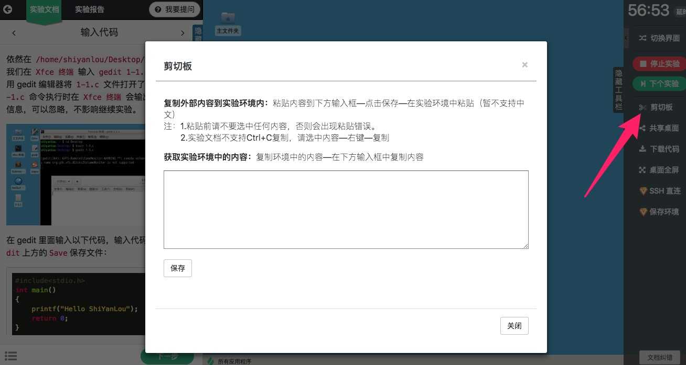

# 剪切板

## 介绍

实验界面工具栏上有一个剪刀按钮，点击此按钮会打开剪切板。

剪切板用来在外部与实验环境之间进行拷贝与粘贴。

## 使用

### 从环境中拷贝文本到外部

在环境中使用右键选择复制，然后打开剪切板，剪切板中的输入框显示内容即实验环境中的系统剪切板内容。

### 向环境中拷贝文本

如果要拷贝内容到实验环境，只需将内容复制粘贴到剪切板的输入框，点击保存按钮，实验环境内部即可使用右键粘贴到这些内容。

## 支持的界面

* [图形界面](../feature/desktop.md)
* [字符界面](../feature/terminal.md)

由于 Jupyter Notebook 和 Web IDE 可以直接拷贝粘贴，所以不需要单独实现剪切板功能。
