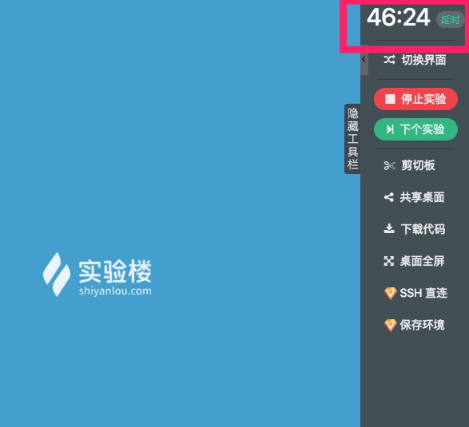

# 倒计时与延时

## 介绍

开始实验后，实验界面右上角有一个倒计时，默认是 1 小时起点，当时间结束后，实验环境将被删除，如果是会员保存的环境，则会被关机。

## 使用

只有当倒计时剩余 10 分钟的时候才可以延时，当临近十分钟和五分钟时会弹出提示，此时用户可以选择是否延时一小时。该功能主要提醒用户充分利用实验时间。

需要注意部分成本比价高的实验（例如使用 GPU 环境的实验）有次数限制，那么延时一次也会算作使用了一次实验。

## 支持的界面

* [图形界面](../feature/desktop.md)
* [字符界面](../feature/terminal.md)
* [Jupyter Notebook](feature/notebook.md)
* [Web IDE](../feature/webide.md)

