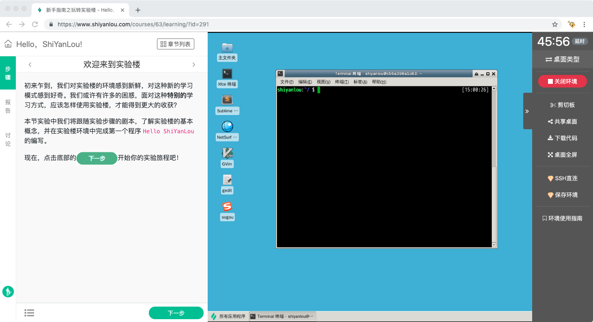

# 图形界面

## 介绍

图形界面提供的是一个提供 Xfce 桌面的 Linux 操作系统，用户可以使用桌面上的各种工具进行实验。目前图形界面是实验楼上应用的课程最多的界面。

## 使用

图形界面使用的是优秀的 Ubuntu Linux 操作系统。Linux 不同于 Windows 环境，初上手有很多不便，但用来学习计算机技术是极好的，大部分互联网公司的开发环境都是 Linux，Linux 也成为越来越多计算机专业学生的必修课。

建议对Linux系统不熟悉的同学，先学习 [Linux基础入门（新版）](https://www.shiyanlou.com/courses/1)。

桌面上有多种工具，其中用的比较多的工具如下：

* Xfce 终端: Linux 命令行终端，打开后会进入 zsh Shell 环境，可以使用 Linux 命令。
* NetSurf 网络浏览器：浏览器，可以用在需要前端界面的课程里，只需要打开环境里写的 HTML/JS页面即可。
* GVim：非常好用的Vim 编辑器，最简单的用法可以参考课程[Vim编辑器](https://www.shiyanlou.com/courses/2)。
* gedit、Sublime：如果您对 gvim 的使用不熟悉，可以用这两个作为代码编辑器。

## 支持的功能

图形界面支持以下功能：

* [实验步骤](../feature/lab_steps.md)
* [实验报告](../feature/lab_reports.md)
* [切换界面](../feature/switch_ui.md)
* [倒计时与延时](../feature/count_down.md)
* [有效学习时间](../feature/study_time.md)
* [剪切板](../feature/clipboard.md)
* [共享桌面](../feature/share_desktop.md)
* [下载代码](../feature/download_code.md)
* [SSH 直连（会员）](../feature/ssh.md)
* [保存环境（会员）](../feature/save_lab.md)

