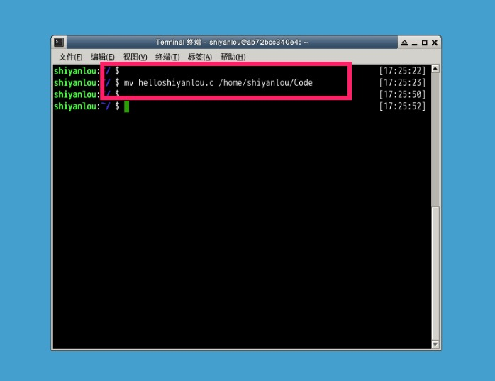
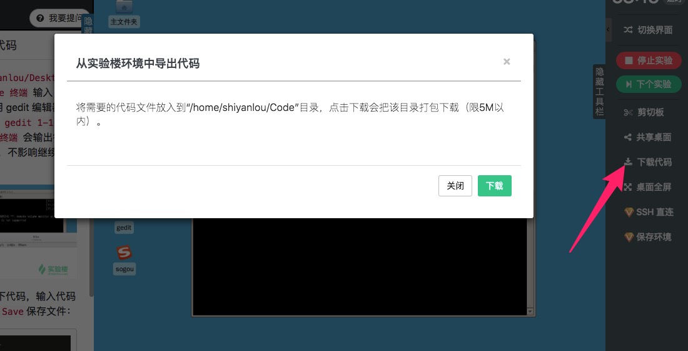

# 下载代码

## 介绍

实验环境中的代码文件如果需要拷贝出来，目前有几种办法：

1. 直接提交到 github
2. 使用下载代码功能

下载代码功能可以在图形界面和字符界面的右边工具栏看到，点击 `下载代码` 按钮后会有弹出框进行引导操作。

## 使用

将需要下载的文件复制或者移动到 `/home/shiyanlou/Code` 目录：

点击实验界面 `下载代码` 按钮，将会将实验环境中的 `/home/shiyanlou/Code` 目录打包下载，可以将代码等需要导出环境的文件放到这个目录下。

代码下载会打开新的窗口，浏览器有可能把窗口拦截了，请查看浏览器地址栏右边是否有提示。另外下载代码限制最大为 5M，如果 `/home/shiyanlou/Code` 太大，会导致后台传输超时。

## 支持的界面

* [图形界面](../feature/desktop.md)
* [字符界面](../feature/terminal.md)
* [Jupyter Notebook](feature/notebook.md)
* [Web IDE](../feature/webide.md)

由于 Jupyter Notebook 和 Web IDE 界面比较特殊，下载代码功能使用需要按照文档上的描述操作。
