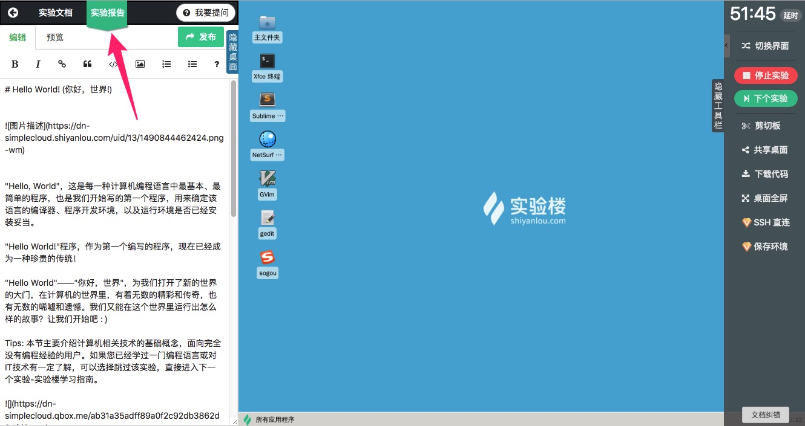
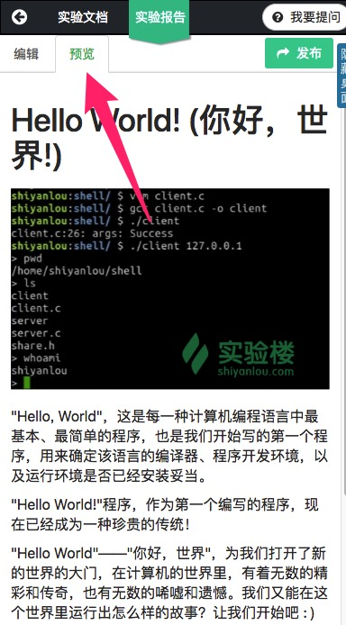
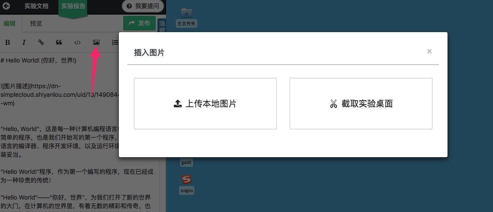
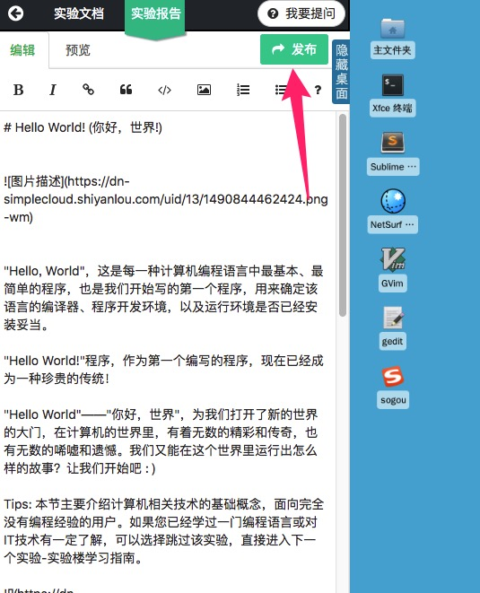

# 实验报告

## 介绍

实验报告可以用来记录实验过程中遇到的问题和收获，也可以被一些教师用来作为实验完成后提交的作业。

实验报告的位置挨着实验步骤，编写实验报告需要使用 Markdown 语法。

## 使用

### 编写实验报告

可以一边实验一边编写实验报告，实验报告中可以插入文字和图片，使用 Markdown 语法可以控制报告最终的显示效果，点击预览可以看到最终效果。

### 保存截图

点击实验报告编辑栏的图片按钮，可以直接将实验环境的界面保存为截图，也可以直接上传本地的图片。

### 发布实验报告

当完成实验报告后，希望公开出去，可以点击发布，发布后实验报告可以被所有人查看。

### 查看实验报告

可以在个人主页的课程历史学习记录里查看自己的实验报告，并可以再次对实验报告进行编辑和设置。

## 支持的界面

* [图形界面](../feature/desktop.md)
* [字符界面](../feature/terminal.md)
* [Web IDE](../feature/webide.md)