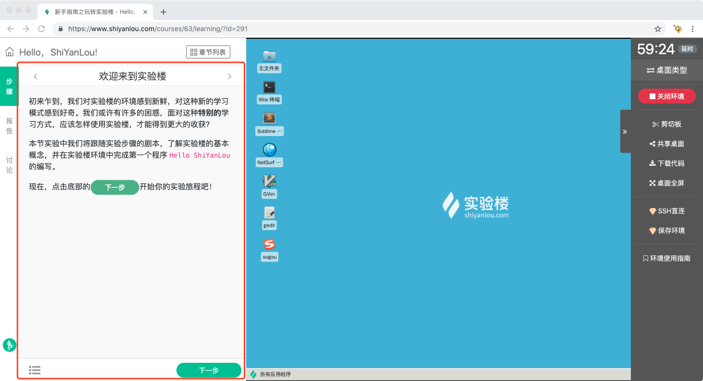
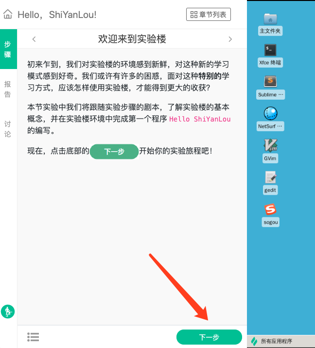
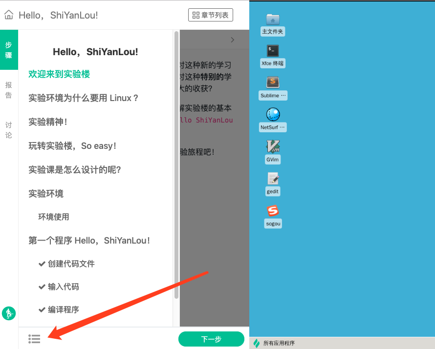
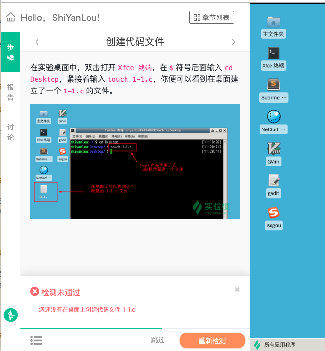

# 实验步骤

## 介绍

每个实验开始后都包括两部分内容：实验步骤和学习界面。学习界面见[界面介绍](../feature/labui.md)。本节详细介绍实验步骤。每个实验中都包含若干个实验步骤，每个步骤中都详细介绍了该步骤需要的理论内容、相关代码以及操作细节，部分配有操作截图。

## 使用

### 下一步

按照步骤内容在学习界面里完成操作，并点击 `下一步` 进入到下一个步骤。

### 查看步骤目录

进入到学习界面后，当前学习章节的实验步骤的目录会短暂显示几秒钟后收起，重新打开需要点击目录按钮。

### 自动验证

完成一个步骤后，需要点击实验步骤下方的 `下一步` 按钮，部分步骤自带自动验证的脚本，验证是否已经完成了该步骤，如果没有完成会提醒错误信息。完成的话会自动显示通过验证，然后跳转到下一步。

## 支持的界面

* [图形界面](../feature/desktop.md)
* [字符界面](../feature/terminal.md)
* [Web IDE](../feature/webide.md)

Jupyter Notebook 的实验步骤已经混合到实验环境中的 Notebook 文档里，因此无法支持通常意义的步骤和自动步骤验证。

如果实验环境使用的是虚拟机，则无法支持自动验证。
