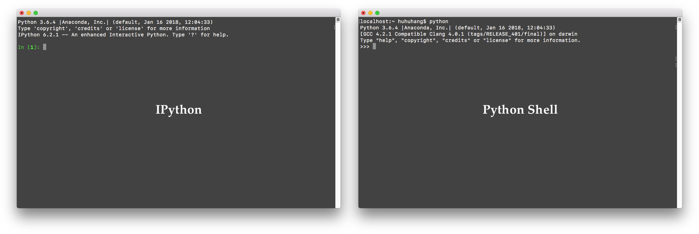
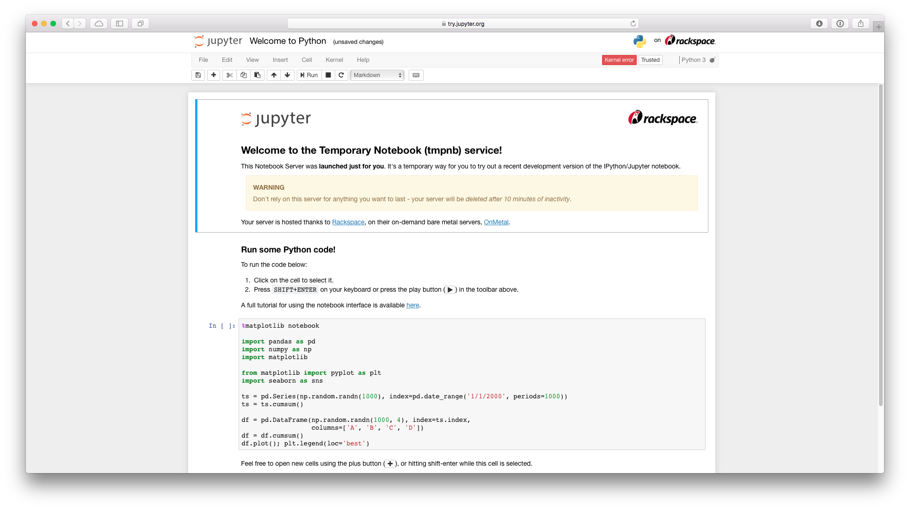
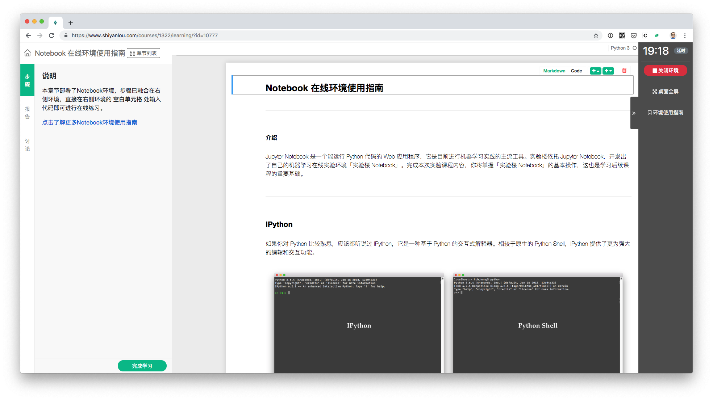
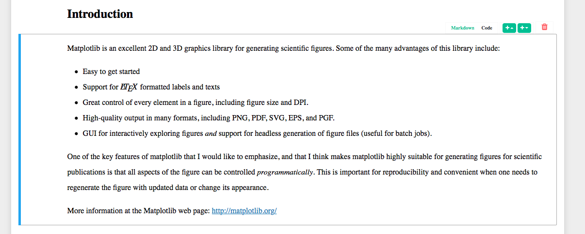
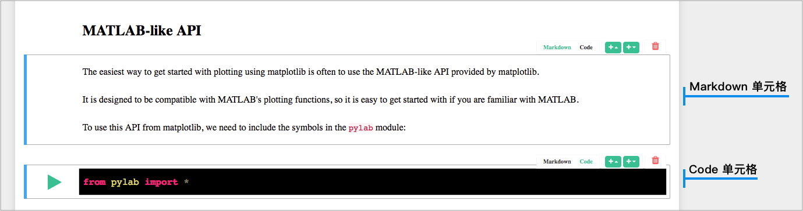
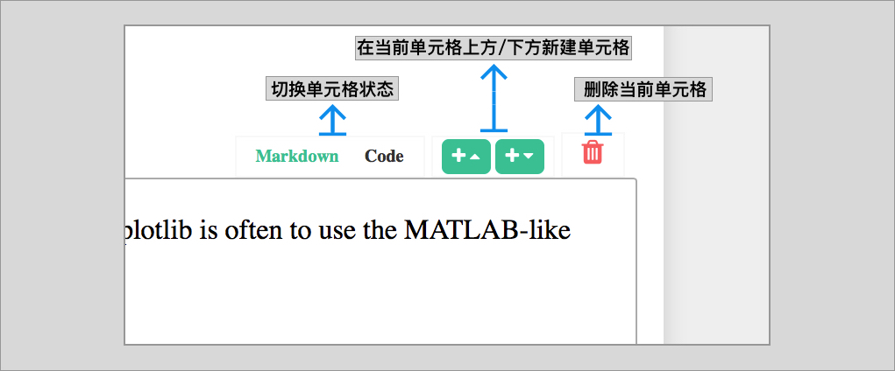
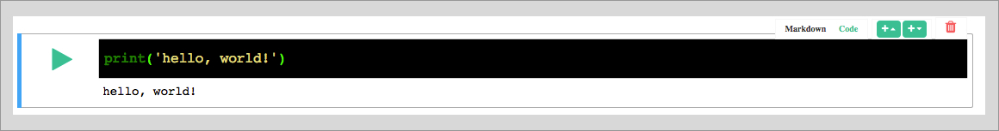
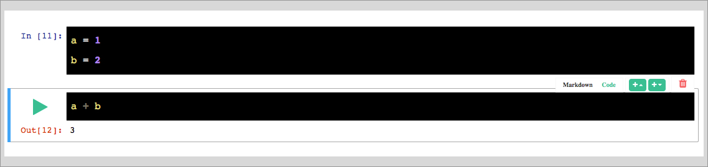
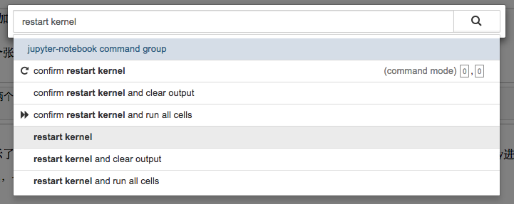

# Jupyter Notebook

特别说明：你可以直接打开 [实验楼 Notebook 在线环境使用指南](https://www.shiyanlou.com/courses/1322) 课程，交互式学习 Notebook 环境的使用。以下是该课程的文字版本。

Jupyter Notebook 是一个能运行 Python 代码的 Web 应用程序，它是目前进行机器学习实践的主流工具。实验楼依托 Jupyter Notebook，开发出了自己的机器学习在线实验环境实验楼 Notebook 环境。

### IPython

如果你对 Python 比较熟悉，应该都听说过 [IPython](https://ipython.org/)，它是一种基于 Python 的交互式解释器。相较于原生的 Python Shell，IPython 提供了更为强大的编辑和交互功能。

IPython 之后，就出现了 IPython Notebook，它完整地继承了 IPython 的交互式特性，同时以 Web 形式运行。IPython Notebook 的出现，让数据分析和机器学习的过程变得高效。

### Jupyter Notebook

再之后，在谷歌、微软等互联网巨头的赞助下，IPython Notebook 发展成为更加成熟和完善的开源项目，并更名为 [Jupyter Notebook](https://jupyter.org/)。相信部分朋友对这个名字和下面的界面并不陌生。

Jupyter Notebook 已经成为现代处理数据的必备工具。从数据清理、数据可视化、数据分析，再到后面的建立机器学习或深度学习模型，都可以在 Jupyter Notebook 完成。同时，Jupyter Notebook 可以保留代码运行后的结果，方便内容的传播，以及回顾做过的工作。

### 实验楼 Notebook

如今，实验楼基于 Jupyter Notebook 开发出了更加简洁易用的实验楼 Notebook 在线实验环境，界面如下所示。

如果你先前使用过 Jupyter Notebook，我们相信当你接触到实验楼 Notebook 环境时会很容易上手。当然，感到陌生的你也完全不用担心，下面就手把手教你实验楼 Notebook 环境的正确使用方法。

目前，实验楼通用的在线环境界面如下图所示，大致分为两部分：左边是实验文档，右边是在线实验环境。学习时，你通过阅读文档内容，并自己动手在右侧的在线环境中练习。

而在实验楼 Notebook 中，学习逻辑就会发生一些变化。如今，实验文档和实验环境被融为一体，你只需要跟随实验楼制作好的每一个课程内容，从头到尾一步一步完成练习即可，就像你现在正在阅读的这份实验文档一样。下面，我们就了解一下课程内容的组成结构。

#### 单元格

内容结构中最基本的组成单位被称之为单元格，一节完整的实验课程由若干个单元格按顺序构成。如下图所示，当你使用鼠标在课程界面【单击】时，就会选中相应的单元格，被处于选中状态的单元格的左侧会出现一条蓝色的竖线。

#### 单元格的两种模式

每一个单元格会有两种模式，分别是 Markdown（文本） 和 Code（代码）。在实验楼的课程中，教学内容都是以 Markdown 单元格展示，而你需要动手练习的代码将在 Code 单元格中执行。

如何判断一个单元格是 Markdown 单元格，还是 Code 单元格？一般有两种方式。首先，选中之后的单元格右上角会出现一个菜单栏，绿色高亮的按钮就代表当前单元格的模式。上图中，就是一个典型的 Markdown 单元格。

除此之外，更简单的方法就是观察单元格的背景色。如下图所示，我们将 Code 单元格的背景色设置成为黑色，而 Markdown 单元格的背景则为白色。

#### 单元格菜单栏

上面提到了单元格右上角的菜单栏。如下图所示，菜单栏中包含了针对单元格常见的 4 种操作。

#### 运行代码

你可能会有疑问，那就是自己在哪里书写练习代码并执行呢？当前，这一切都是在 Code 单元格中完成。如下图所示，当你在 Code 单元格中书写 `print('hello, world!')` 时，点击左侧的运行按钮 ▶，相应的代码就会立即执行，并在单元格的下方显示输出内容。

实验楼 Notebook 沿用了 Jupyter Notebook 全部的快捷键。所以，当你需要执行一个单元格时，也可以通过快捷键 `Shift + Enter` 来运行。使用快捷键的好处是你的双手不需要离开键盘。

你所看到的实验文档内容，都书写在 Markdown 单元格中。如果你一不小心双击了相应单元格进入到编辑状态。不用担心，选中相应单元格，并同样使用快捷键 `Shift + Enter` 执行，就可以恢复到先前的状态。

你在实验环境中输入的字符和代码都是自动保存的。只要当前环境没有终止（点击右上角的停止按钮，或环境超时自动终止），那就无需担心刷新页面后造成自己动手练习代码出现丢失。

#### 单元格执行顺序

无论是 Markdown 单元格，还是 Code 单元格，它们在课程中都是按照从上到下的顺序依次执行的。后面的单元格需要等待前面的单元格执行完成后，才能继续执行。执行完成的单元格左侧会出现 `In [序号]` 的标志，例如：

#### 单元格的执行状态

对于复杂度高的代码，往往会意味着更长的执行等待时间。在实验楼 Notebook 中，当一个单元格处于执行状态时，单元格前面会出现 `In [*]` 符号，只有执行完成的单元格，`[]` 中的 `*` 才会变成相应的 `序号`。

除此之外，你可以通过页面右上角的 Kernel 状态指示器判断内核占用情况。如果 Python 字符右边出现了实心圆圈 ◉，代表内核处于占有状态。而空心圆圈 ◯ 则代表内核处于空闲状态。当然，也可能出现链接断开的符号，那就代表着内核已经断开链接，你可能需要刷新页面或重启实验环境。当然，实验楼会尽力让你避免遇到内核断开的状态。

#### 重启内核

有些时候，当你在运行复杂的代码时，可能会造成实验环境资源占用大而 Notebook 出现「假死」的现象。在遇到这种情况时，你可能不希望重新关闭再打开实验，那么可以执行「重启 Notebook 内核」操作。重启内核需要使用到隐藏命令：

1. 退出单元格编辑状态。
2. 按下 `P` 键，调出 Notebook 命令栏。
3. 在命令栏中输入并选中 `restart kernel` 命令。

执行 `restart kernel` 命令后，如果全部代码单元格的状态都变为 `In []`（执行后留下的数字消失），即代表内核重启成功。由于机器学习很多算法较为复杂，本身执行时间长。所以，大多数情况下都无需重启内核，否则又需要将之前的单元格全部重新执行一遍。

最后，总结常用 Notebook 常用快捷键如下：

- `H`：查看所有快捷键。
- `S`：保存当前 Notebook 内容。
- `P`：调出 Notebook 命令栏。
- `B`：在当前单元格下方新建空白单元格。
- `M`：将单元格格式转换为 Markdown。
- `Y`：将单元格格式转换为 Code。
- 连续按 `D`+`D`：删除当前单元格。（慎用，推荐使用 X 剪切单元格代替，因为其可以起到删除效果，且删错了还可以粘贴回来）
- 连续按 `I`+`I`+`I`：强制中止内核（当某个单元格执行时间较长或卡住时，可以强行中止，中止后前序单元格状态依旧保留，非常好用。）
- `Shift + Enter`：运行当前单元格内容。（当 Markdown 单元格处于编辑状态时，运行即可复原）

### 上手体验

目前实验楼的机器学习和数据分析相关的课程都已经采用了 Jupyter Notebook 界面，如果需要体验，可以尝试以下课程：

1. [《K - 近邻算法实现手写数字识别系统》](https://www.shiyanlou.com/courses/777)
2. [《利用 Python 进行 NBA 比赛数据分析》](https://www.shiyanlou.com/courses/782)
3. [《Pandas 使用教程》](https://www.shiyanlou.com/courses/906)
4. [《NumPy 使用教程》](https://www.shiyanlou.com/courses/912)
5. [《基于 TensorFlow 实现卷积神经网络》](https://www.shiyanlou.com/courses/893)
6. [《Python 气象数据分析：Python 数据分析实战》](https://www.shiyanlou.com/courses/780)
7. [《Hopfield 算法基础讲解及实例实现》](https://www.shiyanlou.com/courses/989)
8. [《RNN 神经网络讲解及基础应用》](https://www.shiyanlou.com/courses/1022)
9. [《SIFT 特征提取分析算法讲解及应用》](https://www.shiyanlou.com/courses/1011)
10. [《利用 Tensorflow 设计简单的前向神经网络》](https://www.shiyanlou.com/courses/1029)
11. [《利用 TensorFlow 进行自然语言处理》](https://www.shiyanlou.com/courses/1026)

### 支持的功能

Jupyter Notebook 界面支持以下功能：

* [倒计时与延时](../feature/count_down.md)
* [有效学习时间](../feature/study_time.md)

Jupyter Notebook 的实验步骤已经混合到实验环境中的 Notebook 文档里，因此无法支持通常意义的步骤和自动步骤验证。