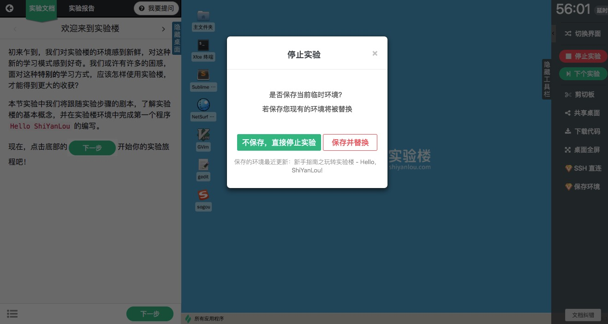
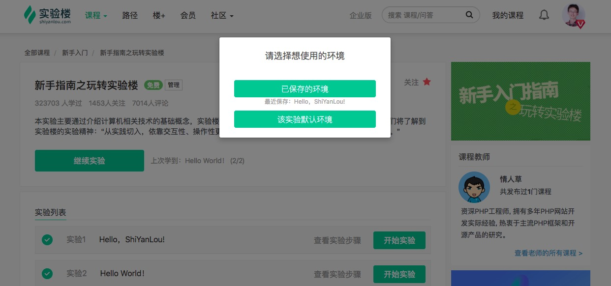

# 保存环境（会员）

## 介绍

保存环境功能指的是将实验过程中用的实验环境关机保存，等下次实验的时候重新启动继续实验。保存环境是实验楼会员功能。注意每个会员用户只能保存一个环境，新保存的环境会替换之前保存的环境。

## 使用

### 如何保存

开始实验后，在实验界面中点击右边工具栏上的 `保存环境` 按钮后会提示信息，确认后当前环境就被保存了。

另外当点击 `停止实验` 的时候，也会询问是否保存当前的实验环境。

如果希望保存当前环境，点击保存按钮。如果之前保存过环境，则会替换旧环境。

### 如何启动

如果开始实验的时候有保存的环境，那么就会询问是否使用保存的环境还是默认的环境，需要注意每个课程的环境可能不同，保存的环境并不能够适配所有的课程。

## 支持的界面

* [图形界面](../feature/desktop.md)
* [字符界面](../feature/terminal.md)

Web IDE 界面的保存环境功能正在开发中，很快就会上线。
