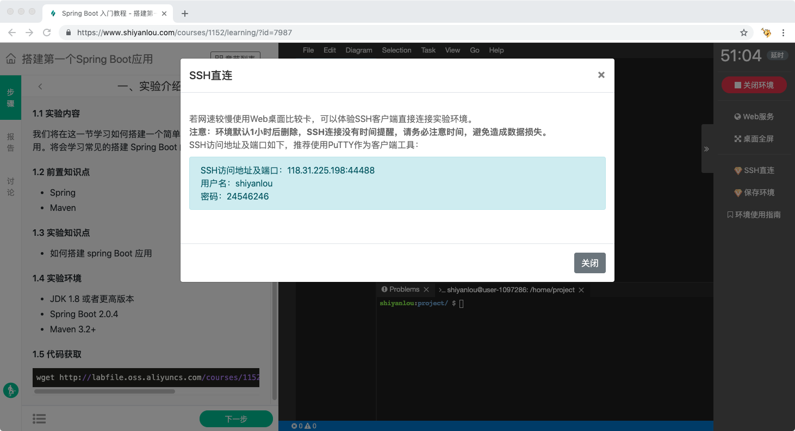

# SSH 直连（会员）

## 介绍

SSH 直连指的是使用本地的 SSH 客户端连接实验环境，把实验环境当成一台远端的 SSH 服务器来使用，连接后在 SSH 客户端中进行实验操作。SSH 直连是实验楼会员功能。




## 使用

开始实验后，在学习界面中点击右边工具栏上的 `SSH 直连` 按钮后会弹出 SSH 连接信息，包括 IP 地址、端口号、用户名及密码。

不同的操作系统 SSH 连接的方式不同，其中在 Linux 及 Mac OS 操作系统上，可以直接打开终端，使用 `ssh` 命令进行连接，连接的语法如下：

```
$ ssh -p 端口 shiyanlou@IP地址
```

例如打开 SSH 直连窗口后得到如下信息：

* IP：10.11.10.1
* 端口：43212
* 用户名：shiyanlou
* 密码：92918199

那么需要在终端中输入以下命令，输入后按照提示输入 yes，然后再输入密码，注意密码输入是看不到的。

```
$ ssh -p 43212 shiyanlou@10.11.10.1
The authenticity of host '[10.11.10.1]:43212 ([10.11.10.1]:43212)' can't be established.
ECDSA key fingerprint is SHA256:+f8C5pSxZq+IUa31ZaEpWkaYNV3Lvk/HUteFFBvjs8w.
Are you sure you want to continue connecting (yes/no)?yes
Warning: Permanently added '[10.11.10.1]:43212' (ECDSA) to the list of known hosts.
shiyanlou@10.11.10.1's password:92918199
Welcome to Ubuntu 16.04.4 LTS (GNU/Linux 3.13.0-125-generic x86_64)

 * Documentation:  https://help.ubuntu.com
 * Management:     https://landscape.canonical.com
 * Support:        https://ubuntu.com/advantage

The programs included with the Ubuntu system are free software;
the exact distribution terms for each program are described in the
individual files in /usr/share/doc/*/copyright.

Ubuntu comes with ABSOLUTELY NO WARRANTY, to the extent permitted by
applicable law.

shiyanlou:~/ $
shiyanlou:~/ $
```

如果使用的是 Windows 操作系统，可以下载 putty 软件进行连接，下载地址：

* [Putty 下载地址](https://www.chiark.greenend.org.uk/~sgtatham/putty/latest.html)

下载后放到桌面，直接双击打开，打开后输入下列信息：

* Host Name：输入 SSH 直连窗口中显示的 IP 地址
* Port：输入 SSH 直连窗口中显示的端口号
* Connection Type：选择 SSH

然后保存为 Session，点击这个 Session，再点击 Open，会开始 SSH 连接。会询问用户名及密码，需要注意的是密码输入是不可见的。

连接后就与字符模式类似，进入到一个 zsh Shell，可以输入 Linux 命令进行操作，也可以使用 Vim 进行程序编辑。

在 SSH 直连中用的比较多的工具如下：

* zsh 终端: Linux 命令行终端，会进入 zsh Shell 环境，可以使用 Linux 命令。
* Vim：非常好用的Vim 编辑器，最简单的用法可以参考课程 [Vim编辑器](https://www.shiyanlou.com/courses/2)。


由于 SSH 协议的限制，SSH 直连的时候不能够切换到桌面，只有命令行的模式，同时不能够在 SSH 客户端中查看实验步骤和编写实验报告，只是单纯的连接到了实验环境中，仍然需要打开浏览器查看实验步骤。

另外需要注意的是 SSH 直连无法计算有效学习时间，也无法获得实验即将结束的通知，需要注意及时保存环境或者及时在 Web 界面中进行延时。

使用 SSH 直连的应用场景通常和字符界面类似，桌面界面使用对网络要求较高，当网络状况不好的时候可以使用 SSH 直连进行实验。另外一种需求是希望能比较方便的和实验环境之间进行文件传输，可以使用 SSH 直连及 scp 命令工具进行实验环境和本地之间的文件拷贝。

## 支持的界面

* [图形界面](../feature/desktop.md)
* [字符界面](../feature/terminal.md)
* [WebIDE界面](../feature/webide.md)