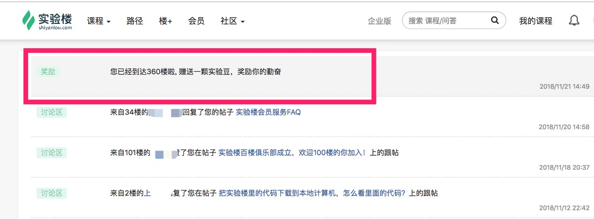
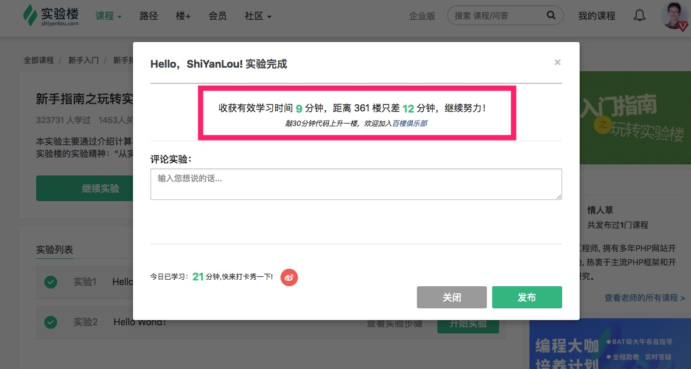
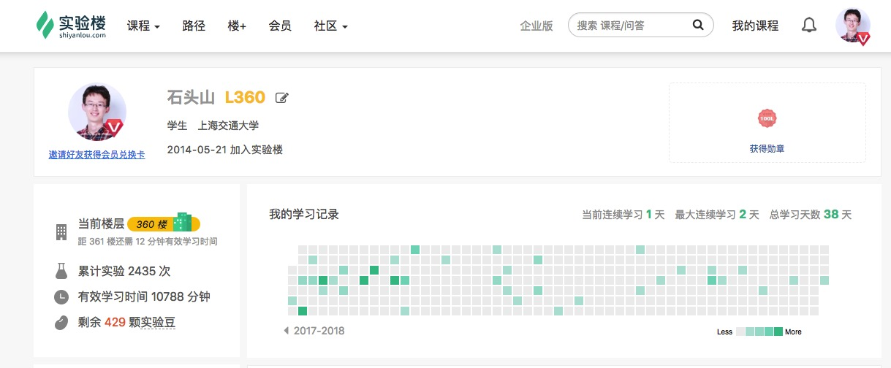

# 有效学习时间

## 介绍

有效学习时间指的是在实验界面里的操作时间。

只有当你在实验界面中动手输入代码或命令时才计入有效学习时间，有效学习时间真实反映你的勤奋程度。开始实验后如果是在查看文档，则不会计算有效学习时间，如果使用[SSH 直连](../feature/ssh.md)也不会计算有效学习时间。

## 使用

只要在实验界面里进行操作，包括输入代码和命令，就可以收获有效学习时间。

每增加 30 分钟有效学习时间上升 1 层楼，并且可以获得 1 个实验豆奖励，获得楼层和实验豆的时候会收到提醒的消息。

停止实验的时候会提示本次实验的时间和有效学习时间。

可以在个人主页查看每天的有效学习时间记录以及楼层。

### 百楼俱乐部

当到达 100 楼的时候，可以申请加入实验楼的 [百楼俱乐部](https://www.shiyanlou.com/questions/6512)。

## 支持的界面

* [图形界面](../feature/desktop.md)
* [字符界面](../feature/terminal.md)
* [Jupyter Notebook](feature/notebook.md)
* [Web IDE](../feature/webide.md)
