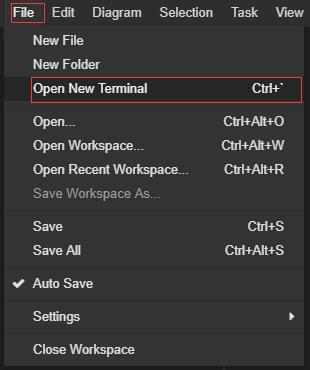
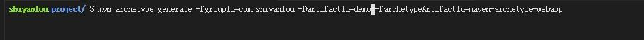
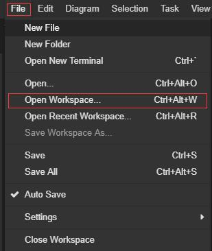
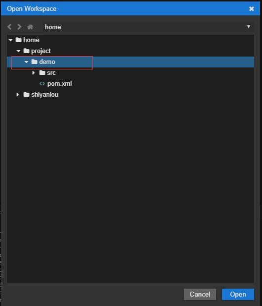
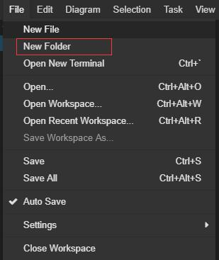
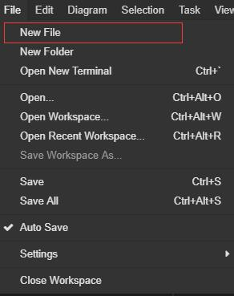
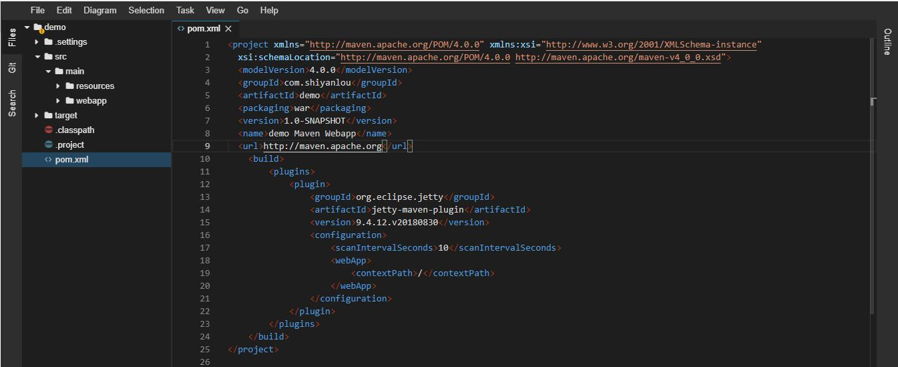
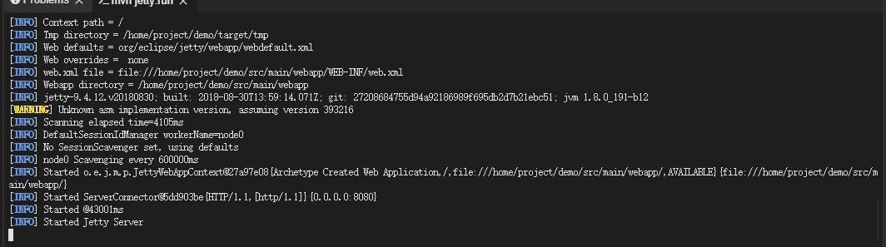
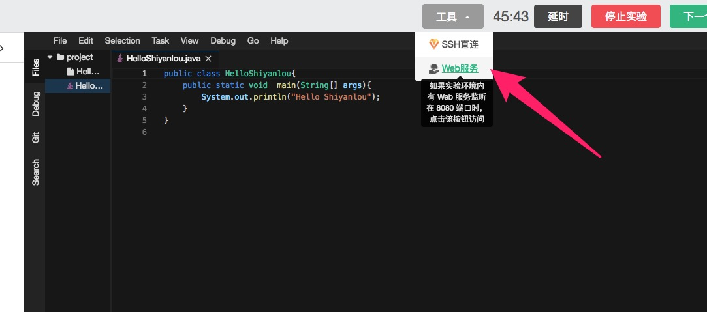
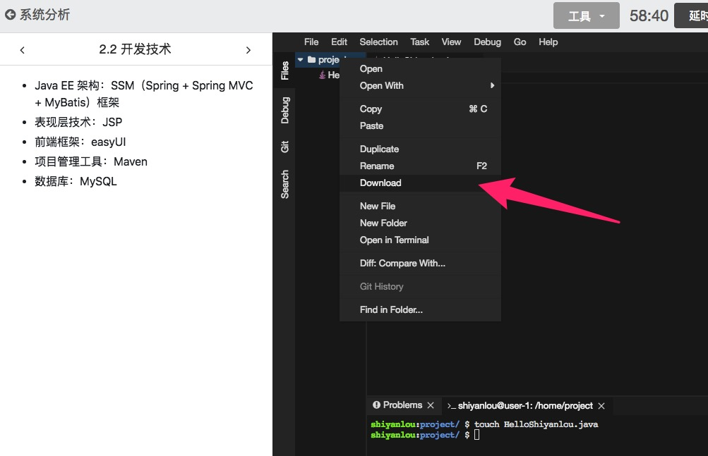

# Web IDE

## 介绍

Web IDE 界面提供的是一个可以在浏览器中编辑代码的 IDE 的界面。在 Web IDE 界面中，可以编辑代码文件，打开 terminal 执行 Linux 命令，还可以在 Terminal 中运行 Web 服务获得临时域名，打开浏览器进行预览测试。


###  界面优势

Web IDE 不同于图形界面，对带宽要求较低，所以比较适用于一些需要大量代码编辑的场景，例如 Java 开发和 Web 前端开发，在之前的桌面环境下需要启动 Eclipse 或 Firefox 浏览器进行代码编写和测试，性能非常差，选择 Web IDE，可以直接在浏览器中进行测试，不需要再嵌套一层 Linux 的 Xfce 桌面。

## 使用

这里以 Java 举例，在 WEB IDE 中，主要使用命令行和 maven 来开发项目。

### 新建项目

首先，点击 `File->Open New Terminal` 打开终端：



在终端中输入命令，使用 maven 建立项目：

```
$ mvn archetype:generate -DgroupId=com.shiyanlou -DartifactId=demo -DarchetypeArtifactId=maven-archetype-webapp
```

这里创建了一个名为 demo 的 maven 项目。



### 切换工作空间

在 Web IDE 中必须要切换到工作空间才可以使用相应的功能，比如 Java 的自动导包等功能。这里的工作空间即是 `/home/project/demo` 目录。

点击 `File-> Open Workspace` 选择对应目录即可。

 



### 添加 package

添加包就是添加文件夹，点击 `File-> New Folder`，新建对应的文件夹即可。



### 添加代码文件

点击 `File->New File` 输入文件名，创建新的代码文件。



### 编写代码

双击创建的代码文件，即可打开文件开始编写代码，例如打开文件 pom.xml，就可以在 Web IDE 中输入以下内容：

```xml
<project xmlns="http://maven.apache.org/POM/4.0.0" xmlns:xsi="http://www.w3.org/2001/XMLSchema-instance"
  xsi:schemaLocation="http://maven.apache.org/POM/4.0.0 http://maven.apache.org/maven-v4_0_0.xsd">
  <modelVersion>4.0.0</modelVersion>
  <groupId>com.shiyanlou</groupId>
  <artifactId>demo</artifactId>
  <packaging>war</packaging>
  <version>1.0-SNAPSHOT</version>
  <name>demo Maven Webapp</name>
  <url>http://maven.apache.org</url>
    <build>
        <plugins>
            <plugin>
                <groupId>org.eclipse.jetty</groupId>
                <artifactId>jetty-maven-plugin</artifactId>
                <version>9.4.12.v20180830</version>
                <configuration>
                    <scanIntervalSeconds>10</scanIntervalSeconds>
                    <webApp>
                        <contextPath>/</contextPath>
                    </webApp>
                </configuration>
            </plugin>
        </plugins>
    </build>
</project>

```





### 运行 Web 服务

在 Java Web 开发过程中，需要运行 Web 服务进行调试，这个时候就需要 Jetty 或者 Tomcat。在上面的配置文件，内置了 Jetty maven 插件，在`demo` 目录下，使用 `mvn jetty:run` 即可启动 Web 服务（注意：只能使用 8080 端口，即默认端口，使用其它端口无法访问）。


启动成功的界面：



### 访问服务

点击上方工具中的 `Web服务` 按钮，即可访问web服务。



此时会单独打开一个浏览器并查看运行的服务内容。如果代码有更新，重新部署后刷新这个单独的浏览器页面即可查看最新内容。

### 在 WEB IDE 运行已有项目

如果在实验中如果需要运行已有项目或者继续之前没有完成的项目，我们只需要在终端（Terminal）中使用 wget 或者 git 获取代码，将工作空间切换到对应的项目根目录即可。

### 下载代码

在 Web IDE 中如果需要下载代码，只需要选中要下载的文件夹或者代码文件，右键选择 Download，就可以下载到本地。下载的代码会被打包成 tar 包，下载后在 Mac 和 Windows 上都可以通过常用的解压软件，例如 7zip 进行解压，在 Linux 上可以使用 tar 命令解压。



## 支持的功能

Web IDE 界面支持的功能：

* [实验步骤](../feature/lab_steps.md)
* [实验报告](../feature/lab_reports.md)
* [倒计时与延时](../feature/count_down.md)
* [有效学习时间](../feature/study_time.md)
* [下载代码](../feature/download_code.md)

保存环境的功能正在开发中，很快会上线。

